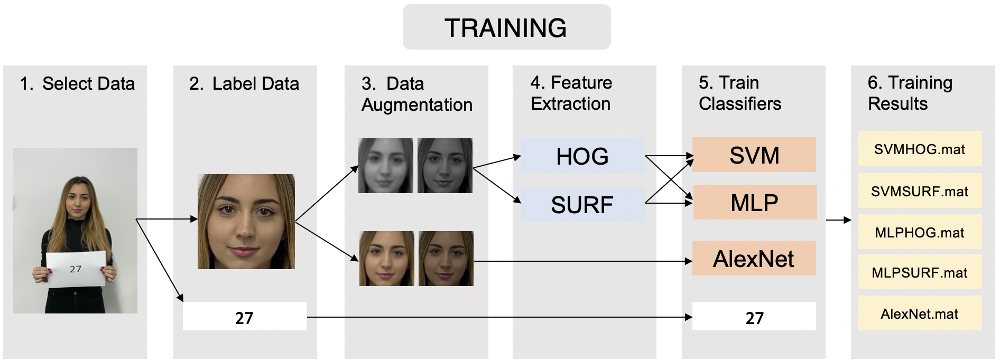

# Face-Recognition

Computer Vision: Face Recognition  

Developed computer vision system to detect and identify individuals using a database of known face images. Images comprise of individual and
group pictures of the author’s classmates.

Files in Repository:

1. Report in PDF format 
2. GetDataGreyscale.m - Script used to extract faces from images and videos for MLP and SVM classifiers 
3. GetDataRGB.m - Script used to extract faces from images and videos for AlexNet classifier
4. TrainOnHOG.m = Script used to train SVM and MLP models on HOG features
5. TrainOnSURF.m - Script used to train SVM and MLP models on SURF features
6. TrainAlexNet.m - Script used to train AlexNet model
7. RecogniseFace.m - RecogniseFace function 

Valid ways to call the RecogniseFace function:

1. RecogniseFace('IMG_6853.JPG', 'HOG' ,'MLP',1)
2. RecogniseFace('IMG_6853.JPG', 'SURF' ,'MLP',1)
3. RecogniseFace('IMG_6853.JPG', 'HOG' ,'SVM',1)
4. RecogniseFace('IMG_6853.JPG', 'SURF' ,'SVM',1)
5. RecogniseFace('IMG_6853.JPG', 'NONE' ,'AlexNet',1)

- Replace the 1 with 0 to view the results without the creative mode
- Replace the image file to test on different images
